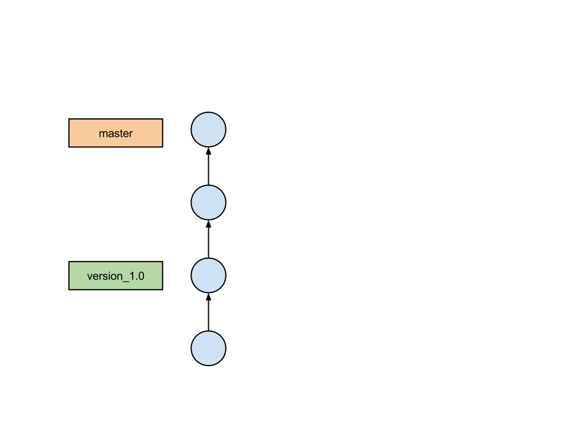

# Version Control with Git

Lars Kellogg-Stedman <lars@oddbit.com>

---

## Why are we here?

- An introduction to version control.
- Some basic recipes for using git.
- Questions and answers.

# Ask lots of questions.

---

## What is version control?

Tracking the changes to your documents over time.

This is very simple version control:

    $ cp myfile.1 myfile.2
    $ cp myfile myfile.1
    $ edit myfile

It doesn't scale very well.

---

## Recoverability

Like having infinite undo.

---

## Maintainability

Fix bugs in older versions of your project
without disturbing current development.

---

## Exploration

Experiment with your code without worrying about losing something
important.

---

## Collaboration

Allow multiple people to work together on the same project.

---

# Key concepts

---

## Repository

A data structure storing a set of files and their history of changes.

---

## Working copy

The set of files you are editing.  You "check out" files from the
repository into your working copy, and "commit" changes to your
working copy back to the repository.

---

## Commit

- (*noun*) The state of your project at a certain point in time.
- (*verb*) To record the current state of your files in the repository.

---

## Branches and tags

Symbolic names that refer to commits in your repository.

- *Branches* move forward with each new commit.

- *Tags* point at a fixed commit.

---

# Cookbook

---

## Getting help

All git commands include extensive built-in documentation:

    $ git <subcommand> --help

For example:

    $ git commit --help

---

## Creating a repository

From scratch:

    $ git init myproject

With existing files:

    $ cd myproject
    $ git init

Add all your files to the repository:

    $ git add .
    $ git commit -m "added all my files"

---

## Adding files

Stage changes to be committed:

    $ git add file1
    $ git add file2

Commit the changes:

    $ git commit

This will bring up an editor in which you can enter your commit
message.  You can also provide a message on the command line:

    $ git commit -m "This is my commit message."

### Tips

Stage all local modifications:

    $ git add -u

(This does not add new files.)

---

### What's changed?

To see files in your working copy that have been modified:

    $ git status

To see how your working copy differs from the repository:

    $ git diff

---

## Reverting changes

If you want to discard edits to a file that you have not yet
committed:

    $ git checkout file1

---

## Cloning a remote repository

    $ git clone git@code.seas.harvard.edu:myteam/myproject.git

This results in working directory `myproject` with the repository data
in `myproject/.git/`.

---

# A story of collaboration

---

---

---

---

---

---

---

---

# A story of conflict

---

---

---

---

---

---

# Installing git

---

## For Linux

Git is available from your distribution.  If you are using
Fedora, CentOS, or RHEL, try:

    $ sudo yum install git

If you are using Ubuntu or Debian, try:

    $ sudo yum install git-core

---

## For OS X

The [git website][] provides an [installer for OS X][osx installer],
but you will probably be better off installing [Homebrew][], a
collection of open source software for OS X, and then running:

    $ brew install git

[git website]: http://git-scm.org
[osx installer]: http://git-scm.com/download/mac
[homebrew]: http://brew.sh/

---

## For Windows

The [git website][] provides an [installer for Windows][windows installer].

[git website]: http://git-scm.org
[windows installer]: http://git-scm.com/download/win

---

## GUI clients and editor integration

There are many [GUI clients] for git.

[gui clients]: http://git-scm.com/downloads/guis

Most good programmer's editors include some form of git integration.

---

# Getting Started

---

## Initial configuration: Identity

Tell git who you are:

    $ git config --global user.name "Lars Kellogg-Stedman"
    $ git config --global user.email "lars@oddbit.com"

These values will be included in your commits:

    $ git log
    commit 60f3de47e36eebbcf4cde4655096e73d0dc24f3e
    Author: Lars Kellogg-Stedman <lars@oddbit.com>
    Date:   Fri Feb 14 17:52:01 2014 -0500

        This is my commit message.

---

## Initial configuration: Editor

Select an editor.  This will be used when `git` requires you to enter
extended information (like a commit message):

    $ git config --global core.editor <YOUR EDITOR>

