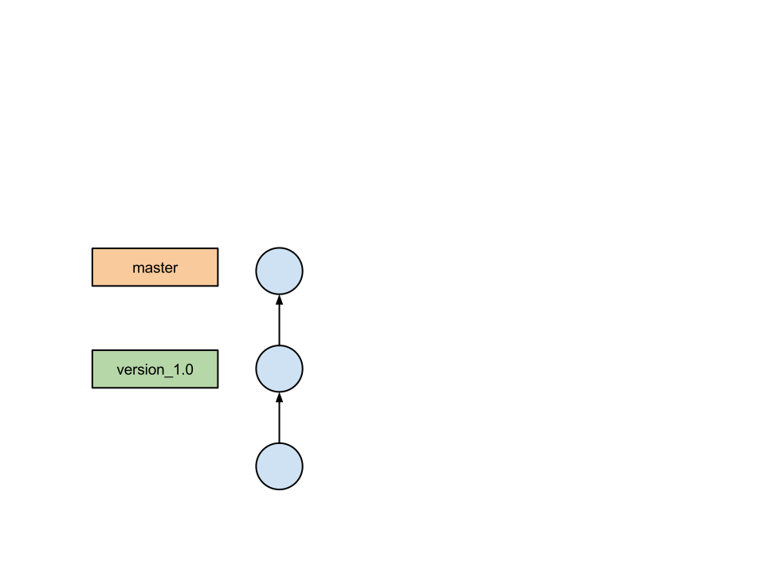

# Version Control with Git

Lars Kellogg-Stedman <lars@oddbit.com>

<http://oddbit-workshops.github.io/harvard-git-workshop/>

---

## Why are we here?

- An introduction to version control.
- Some basic recipes for using git.
- Questions and answers.

# Ask lots of questions.

---

## What is version control?

Tracking the changes to your documents over time.

This is very simple version control:

    $ cp myfile.1 myfile.2
    $ cp myfile myfile.1
    $ edit myfile

It doesn't scale very well.

---

## Recoverability

Like having infinite undo.

---

## Maintainability

Fix bugs in older versions of your project
without disturbing current development.

---

## Exploration

Experiment with your code without worrying about losing something
important.

---

## Collaboration

Allow multiple people to work together on the same project.

---

# Key concepts

---

## Repository

A data structure storing a set of files and their history of changes.

---

## Working copy

The set of files you are editing.  You "check out" files from the
repository into your working copy, and "commit" changes to your
working copy back to the repository.

---

## Commit

- (*noun*) The state of your project at a certain point in time.
- (*verb*) To record the current state of your files in the repository.

In `git`, commits are uniquely identified by a 40 character hash, like
this:

    d8c554432e316851f7e66e0e7d8bfc8f08083618

But you can also name them using abbreviated hashes:

    d8c55

And by a variety of symbolic names:

    master
    HEAD
    version_1.0

If you are curious:

    git rev-parse --help

---

## Branches and tags

Symbolic names that refer to commits in your repository.

- *Branches* move forward with each new commit.

- *Tags* point at a fixed commit.

---

# Cookbook

---

## Getting help

All git commands include extensive built-in documentation:

    $ git <subcommand> --help

For example:

    $ git commit --help

---

## Creating a repository

From scratch:

    $ git init myproject

With existing files:

    $ cd myproject
    $ git init

Add all your files to the repository:

    $ git add .
    $ git commit -m "added all my files"

Which looks something like this:

    $ cd hello-2.9
    $ git init
    Initialized empty Git repository in /home/lkellogg/projects/harvard-git-workshop/sandbox/hello-2.9/.git/
    $ git add .
    $ git commit -m 'initial import'
    [master (root-commit) d8c5544] initial import
     291 files changed, 90160 insertions(+)
     create mode 100644 ABOUT-NLS
     create mode 100644 AUTHORS
    .
    .
    .
     create mode 100755 tests/last-1
     create mode 100755 tests/traditional-1

---

## Adding files/modifications

Stage changes to be committed:

    $ git add file1
    $ git add file2

Commit the changes:

    $ git commit

This will bring up an editor in which you can enter your commit
message.  You can also provide a message on the command line:

    $ git commit -m "This is my commit message."

### Tips

Stage all local modifications:

    $ git add -u

(This does not add new files.)

---

## Removing and renaming files

Remove a file from your repository:

    $ git rm myfile.txt

Renaming a file:

    $ git mv myfile.txt anotherfile.txt

And commit the changes:

    $ git commit

---

## What's changed?

To see files in your working copy that have been modified:

    $ git status

To see how your working copy differs from the repository:

    $ git diff

Output of `git status` with no pending changes:

    $ git status
    # On branch master
    nothing to commit, working directory clean

Output of `git status` with modified files in the working copy:

    $ git status
    # On branch master
    # Changes not staged for commit:
    #   (use "git add <file>..." to update what will be committed)
    #   (use "git checkout -- <file>..." to discard changes in working directory)
    #
    #	modified:   src/hello.c
    #
    no changes added to commit (use "git add" and/or "git commit -a")

Output of `git diff` with modified files in the working copy:

    $ git diff
    diff --git a/src/hello.c b/src/hello.c
    index 8c36915..b546447 100644
    --- a/src/hello.c
    +++ b/src/hello.c
    @@ -16,6 +16,9 @@
        You should have received a copy of the GNU General Public License
        along with this program.  If not, see <http://www.gnu.org/licenses/>.  */
     
    +#define PACKAGE_NAME "harvard_hello"
    +#define PACKAGE_URL "http://harvard.edu/harvard_hello"
    +
     #include <config.h>
     #include "system.h"
     #include "progname.h"

---

## Viewing history

To view the commit messages in your repository:

    $ git log

To see the commits along with the changes they introduced:

    $ git log -p

The output of `git log` looks something like this:

    commit 99bbf5e53f3d4c5cc7d3f9f0da0e03426e200695
    Author: Sami Kerola <kerolasa@iki.fi>
    Date:   Wed Nov 20 00:59:37 2013 +0000

        add git-version-gen from gnulib/build-aux
        
        * configure.ac: change AC_INIT version to call a script
        * git-version-gen: add version determinator script

    commit 7037566cb87ea8ad59a9ab7079225510cef84ddd
    Author: Reuben Thomas <rrt@sc3d.org>
    Date:   Thu Oct 10 14:19:04 2013 +0100

        Update Thai strings.

The output of `git log -p` looks something like this:

    commit 3a74f02ba241a8e2517362df6fd68dac462e60d5
    Author: Lars Kellogg-Stedman <lars@redhat.com>
    Date:   Mon Feb 24 23:05:52 2014 -0500

        a sample change

    diff --git a/src/hello.c b/src/hello.c
    index 8c36915..b546447 100644
    --- a/src/hello.c
    +++ b/src/hello.c
    @@ -16,6 +16,9 @@
        You should have received a copy of the GNU General Public License
        along with this program.  If not, see <http://www.gnu.org/licenses/>.  */
     
    +#define PACKAGE_NAME "harvard_hello"
    +#define PACKAGE_URL "http://oddbit.com/harvard_hello"
    +
     #include <config.h>
     #include "system.h"
     #include "progname.h"

---

## Tags

To apply a symbolic name ("tag") to the current commit:

    $ git tag mytag

To view existing tags:

    $ git tag

---

## Branches

To create a new branch based on your current branch:

    $ git checkout -b newbranch

To create a new branch based on a specific commit:

    $ git checkout -b bugfixes/1.0 version_1.0

To switch between branches:

    $ git checkout <branchname>

---

# When good code goes bad

---

## Fixing a commit

If you commit some changes but realize you forgot something:

    $ git add file_i_forgot.txt
    $ git commit --amend

---

## Discarding changes to a file

To discards edits that you have made to a file but have not yet
committed:

    $ git checkout -- myfile.txt

---

## Reverting a previous commit

To revert changes made in an earlier commit:

    $ git revert <commit>

For example:

    $ git revert 8b8cc60

---

## Throwing away history

`git reset` discards history from your repository.  To get rid of
all commits after a specific commit:

    $ git reset <commit>

For example:

    $ git reset HEAD~

This command *does not affect your working copy*.

To also affect your working copy, add `--hard`:

    $ git reset --hard HEAD~

Reasons to reset:

- You've made a series of bad local commits and you want to do them
  over in a more organized fashion.

- You want to discard a bunch of local (uncommitted) modifications and
  return return to `HEAD`:

      git reset --hard HEAD

---

# A story of collaboration

---

---

---

<!-- -->

    $ git remote add origin git@code.seas.harvard.edu:myteam/myproject.git
    $ git push -u origin master
    Counting objects: 4193, done.
    Delta compression using up to 8 threads.
    Compressing objects: 100% (1072/1072), done.
    Writing objects: 100% (4193/4193), 7.65 MiB | 0 bytes/s, done.
    Total 4193 (delta 3095), reused 4193 (delta 3095)
    To ../hello-remote.git/
     * [new branch]      master -> master
    Branch master set up to track remote branch master from origin.

---

<!-- -->

    $ git clone git@code.seas.harvard.edu:myteam/myproject.git
    Cloning into 'myproject'...
    done.

<!-- -->

    $ git remote -v
    origin  git@code.seas.harvard.edu:myteam/myproject.git (fetch)
    origin  git@code.seas.harvard.edu:myteam/myproject.git (push)

---

---

<!-- -->

    $ git push
    Counting objects: 5, done.
    Delta compression using up to 8 threads.
    Compressing objects: 100% (3/3), done.
    Writing objects: 100% (3/3), 348 bytes | 0 bytes/s, done.
    Total 3 (delta 1), reused 0 (delta 0)
    To git@code.seas.harvard.edu:myteam/myproject.git
       f95bae7..f9120d5  master -> master

---

<!-- -->

    $ git pull
    remote: Counting objects: 5, done.
    remote: Compressing objects: 100% (3/3), done.
    remote: Total 3 (delta 1), reused 0 (delta 0)
    Unpacking objects: 100% (3/3), done.
    From git@code.seas.harvard.edu:myteam/myproject.git
       f95bae7..f9120d5  master     -> origin/master
    Updating f95bae7..f9120d5
    Fast-forward
     TODO | 2 ++
     1 file changed, 2 insertions(+)

---

# A story of conflict

---

---

---

<!-- -->

    $ git push
    To git@code.seas.harvard.edu:myteam/myproject.git
     ! [rejected]        master -> master (non-fast-forward)
    error: failed to push some refs to '../hello-remote.git/'
    hint: Updates were rejected because the tip of your current branch is behind
    hint: its remote counterpart. Merge the remote changes (e.g. 'git pull')
    hint: before pushing again.
    hint: See the 'Note about fast-forwards' in 'git push --help' for details.

---

<!-- -->

    $ git pull
    Auto-merging TODO
    Merge made by the 'recursive' strategy.
     TODO | 2 +-
     1 file changed, 1 insertion(+), 1 deletion(-)

---

---

## But what if Alice and Bob made overlapping changes?

    $ git pull
    remote: Counting objects: 10, done.
    remote: Compressing objects: 100% (6/6), done.
    remote: Total 6 (delta 3), reused 0 (delta 0)
    Unpacking objects: 100% (6/6), done.
    From git@code.seas.harvard.edu:myteam/myproject.git
       1827d91..dab8832  master     -> origin/master
    Auto-merging TODO
    CONFLICT (content): Merge conflict in TODO
    Automatic merge failed; fix conflicts and then commit the result.

<!-- -->

    WRITE MORE CODE

    GNU hello --- TODO

    Todo:

    <<<<<<< HEAD
        * Write more awesome code.
    =======
        * buy new laptop
    >>>>>>> dab88328f5f521bbd40135e36110d33924d0f529
        * submit a new hello.pot.

    end of file TODO

To fix the conflict:

- Manually correct the file.
- Add the changes to the repository:

      git add TODO

- Commit the changes

      git commit

---

# Installing git

---

## For Linux

Git is available from your distribution.  If you are using
Fedora, CentOS, or RHEL, try:

    $ sudo yum install git

If you are using Ubuntu or Debian, try:

    $ sudo yum install git-core

---

## For OS X

The [git website][] provides an [installer for OS X][osx installer],
but you will probably be better off installing [Homebrew][], a
collection of open source software for OS X, and then running:

    $ brew install git

[git website]: http://git-scm.org
[osx installer]: http://git-scm.com/download/mac
[homebrew]: http://brew.sh/

---

## For Windows

The [git website][] provides an [installer for Windows][windows installer].

[git website]: http://git-scm.org
[windows installer]: http://git-scm.com/download/win

---

## GUI clients and editor integration

There are many [GUI clients] for git.

[gui clients]: http://git-scm.com/downloads/guis

Most good programmer's editors include some form of git integration.

---

# Getting Started

---

## Initial configuration: Identity

Tell git who you are:

    $ git config --global user.name "Lars Kellogg-Stedman"
    $ git config --global user.email "lars@oddbit.com"

These values will be included in your commits:

    $ git log
    commit 60f3de47e36eebbcf4cde4655096e73d0dc24f3e
    Author: Lars Kellogg-Stedman <lars@oddbit.com>
    Date:   Fri Feb 14 17:52:01 2014 -0500

        This is my commit message.

---

## Initial configuration: Editor

Select an editor.  This will be used when `git` requires you to enter
extended information (like a commit message):

    $ git config --global core.editor <YOUR EDITOR>

---

# For more information

- [Pro Git][], by Scott Chacon

  Very well written with both introductory and advanced topics.

- [try.github.io][]

  This interactive tutorial provides a hands-on introduction to the
  git command line.

- [Git Immersion][]

  Teaches git through a series of practical exercises.

[pro git]: http://git-scm.com/book/
[try.github.io]: http://git-scm.com/book/
[git immersion]: http://gitimmersion.com/

---

## About these slides

- The source for these slides is available from
  https://github.com/oddbit-workshops/harvard-git-workshop/.

- These slides are written in [Markdown][] and rendered
  using [reveal.js].

[markdown]: http://daringfireball.net/projects/markdown/
[reveal.js]: https://github.com/hakimel/reveal.js/

